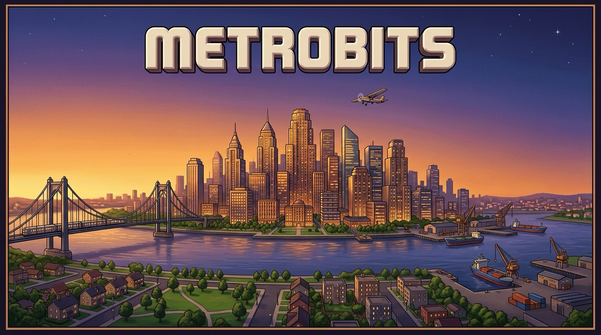

# Metrobits (built on Micropolis)

Metrobits is Micropolis, the city simulator first released in 1989. Its source code was opened up in 2008, and Metrobits rebuilds it to run on a modern Mac, Windows PC or Linux PC with its original look and feel.

Metrobits is a modified version of Micropolis. Electronic Arts and Micropolis GmbH don't make, endorse or support it.

## Install it

Download the file for your computer from [Releases](https://github.com/alexherrero/metrobits/releases).

**Mac:** download `Metrobits-<version>.pkg`, open it and follow the installer. It puts Metrobits in your Applications folder. Metrobits runs on Apple Silicon and Intel Macs. The installer and the app are signed and notarized by Apple.

**Windows:** download `Metrobits-<version>-setup.exe`, open it and follow the installer. It puts Metrobits in your Program Files folder and adds it to the Start menu. The installer isn't signed yet, so Windows may stop it with "Windows protected your PC": choose **More info**, then **Run anyway**. Metrobits runs on 64-bit Windows 10 and 11. To remove it, use **Installed apps** in Windows' Settings.

**Linux:** download `Metrobits-<version>-x86_64.AppImage`. It's the whole game in one file. Make it executable, then open it: in your file manager, allow it to run as a program in its properties; or in a terminal, run `chmod +x Metrobits-<version>-x86_64.AppImage`, then `./Metrobits-<version>-x86_64.AppImage`. Metrobits runs on 64-bit Intel and AMD PCs. If it won't open, install your distribution's FUSE package, usually `fuse3`.

## Play it

You're the mayor. Your job is to build a city and keep the people who live there happy.

**Start a city.** Metrobits opens on the city chooser, where you can:

- pick one of eight scenarios, each a city with a problem you have a few years to fix;
- generate new land, choose Easy, Medium or Hard, and press Play This Map to build from nothing;
- load a city you saved.

**Build it.** Pick a tool from the palette beside the map, then click or drag on the map. You can also right-click the map for the pie menus, a quicker way to pick a tool. As you build:

- zone land for homes (residential), shops and offices (commercial), and factories (industrial);
- connect the zones with roads and rail;
- build a power plant and run power lines to every zone, so it can grow;
- add police and fire stations and parks, then a stadium, a seaport and an airport as the city grows.

**Keep it running.** The game tells you how your city is doing:

- The demand gauge in the head window shows which kind of zone your city wants next.
- Messages and notices warn you about problems such as traffic, pollution and crime.
- The Windows menu opens the budget, the evaluation, the graphs and the map.
- Once a year, the budget asks you to set the tax rate and the money for roads, police and fire.

**Control time and save your work.** These menus are along the top:

- **Priority** sets the game's speed, or pauses it.
- **Disasters** starts a disaster. You can switch random disasters off in **Options**.
- **Micropolis**, then **Save City**, saves your city.

## Quality-of-life improvements

These have been added to the original game:

- the Air Crash disaster;
- the Water, Land, Forest and Network tools;
- zooming, and moving the map with Space or the trackpad;
- a key for every tool, and 0 to 3 to pause and set the speed;
- a preview of what a tool will build before you click;
- a Budget button, and the population and speed in the head window;
- a setting to turn disasters off, and settings that stay between sessions;
- short descriptions of "Start a New City" and "Restore a Saved City" in the chooser.

## Licences and credits

Metrobits is free software under the GNU General Public License, version 3 (`LICENSE`), with Electronic Arts' additional terms (`micropolis-core/MicropolisGPLLicenseNotice.md`).

Micropolis is a registered trademark of Micropolis Corporation (Micropolis GmbH) and is licensed here as a courtesy of the owner under the [Micropolis Public Name License](https://www.micropolis.com) (`micropolis-core/MicropolisPublicNameLicense.md`).

Here's where everything comes from:

- **The engine** is [MicropolisCore](https://github.com/SimHacker/MicropolisCore). `micropolis-core/UPSTREAM.md` names the version we use and every change we made to it.
- **The pictures, sounds and cities** are each traced back to the 2008 open-source release in `micropolis-core/CONTENT-PROVENANCE.md`.
- **The original game files** we use are listed in `micropolis-core/olpc/PROVENANCE.md`.
- **The DejaVu LGC fonts** come with their own licence, in `micropolis-core/olpc/res/dejavu-lgc/LICENSE`.

The people who made the original game are credited inside it. Open the Micropolis menu and choose About.
